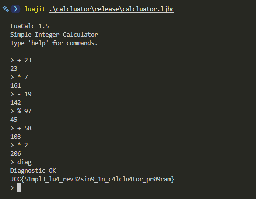

## Calcluator - Proof of Concept

> JCC 2026 - Reverse Engineering - Medium - UrSourceCode

### Distributable Artifact

File release berisi LuaJIT bytecode yang dikompilasi menggunakan LuaJIT 2.1.1720049189 (x86_64).

String dan constant masih bisa direcover menggunakan tools seperti:

```bash
strings calcluator.ljbc
luajit -bl calcluator.ljbc
```

```text
...
string
=c479d34633443c69c19b5002c1c2ecc66b858745aa2ab15051ae741cf5a5e0f07c10b23ccce6014fc6716c69268d74e
5765712076b155dcbe21fde9
```

```text
-- BYTECODE -- calcluator.ljbc:0-0
0001    KSHORT   2   0
0002    KSHORT   3   1
0003 => KSHORT   4   0
0004    ISLT     4   0
0005    JMP      4 => 0009
0006    KSHORT   4   0
0007    ISGE     4   1
0008    JMP      4 => 0027
0009 => LOOP     4 => 0027
...
```

Dari sini kita bisa menemukan command pada calcluator, operator, beberapa blob (target dan encrypted flag), serta command `diag` yang dibentuk dari `string.char(100, 105, 97, 103)`.

Online decompiler juga bisa digunakan sebagai starting point yang lebih cepat:
[Decompiler.com result for `calcluator.lua`](https://www.decompiler.com/jar/3e48e1521a443b66a29655dc1ec30eaa/calcluator.lua)

### Validation Mechanism

Program menyimpan empat value penting:

```lua
ans   = 0
state = 0x1337
step  = 0
bad   = 0
```

- `ans` = hasil kalkulator saat ini
- `state` = hidden internal state
- `step` = jumlah operation yang sudah dimasukkan
- `bad` = jumlah operation salah yang sudah dimasukkan

Setiap operation pada kalkulator akan mengubah `ans` dan `state`. Program juga menghitung sebuah signature:

```lua
x = (value + tag * 257 + step * 911 + (before % 65521) * 13) % 65521
sig = (x * 251 + (result % 65521) * 17 + state) % 65521
```

Masing-masing operator memiliki tag yang berbeda:

```text
+ is 17    - is 29    * is 43    / is 61    % is 79
```

Jadi `+ 23` dan `* 23` akan menghasilkan checksum yang berbeda karena operator tag-nya juga berbeda.

Program mengharapkan enam checksum tertentu:

```text
25943, 8305, 45430, 56405, 8638, 59901
```

Setelah setiap calculation, checksum yang dihasilkan akan dibandingkan dengan expected value pada step tersebut. Kalau tidak cocok, value `bad` akan bertambah.

Hidden command `diag` hanya akan melakukan decrypt flag jika:

```lua
step == 6
bad == 0
```

Artinya, tepat enam operation harus dimasukkan dan seluruh checksum-nya harus sesuai dengan expected value.

Kalau tidak, program hanya akan menampilkan:

```text
Diagnostic failed
```

Encrypted flag disimpan dalam bentuk hexadecimal bytes. Decryption seed diturunkan dari final calculator state dan answer:

```lua
seed = (state + (ans % 256) * 257 + 0x5A) % 256
```

Untuk sequence yang benar, final value-nya adalah `ans = 206` dan `state = 47516`, sehingga menghasilkan initial decryption seed sebesar `196`.

Untuk setiap encrypted byte, program akan meng-update sebuah linear generator kecil lalu melakukan XOR antara byte yang dihasilkan dengan ciphertext:

```lua
seed = (seed * 73 + 41) % 256
plain_byte = ciphertext_byte XOR seed
```

Jadi flag hanya bisa direcover setelah state dari enam operation yang benar berhasil didapatkan.

### Solving

Karena setiap operand dibatasi pada range `0..255`, sequence-nya bisa dicari step by step.

Untuk setiap target checksum, kita bisa brute-force kelima operator dengan operand `0..255`, lalu menyimpan candidate yang menghasilkan `sig` sesuai target pada step tersebut. Setelah itu, lanjutkan menggunakan `ans` dan `state` yang sudah ter-update.

Unique sequence yang didapat adalah:

```text
+ 23
* 7
- 19
% 97
+ 58
* 2
diag
```

Intermediate answer-nya adalah:

```text
0 + 23  = 23
23 * 7  = 161
161 - 19 = 142
142 % 97 = 45
45 + 58  = 103
103 * 2  = 206
```

Pada akhirnya, `ans` bernilai `206` dan final internal state adalah `47516`.



### Tips

1. Saat menggunakan `strings`, LuaJIT bytecode bisa mengandung printable metadata atau prefix bytes sebelum actual string constant. Pada challenge ini, encrypted hex string yang benar dimulai dari `479d...`, bukan `=c479d...`.
