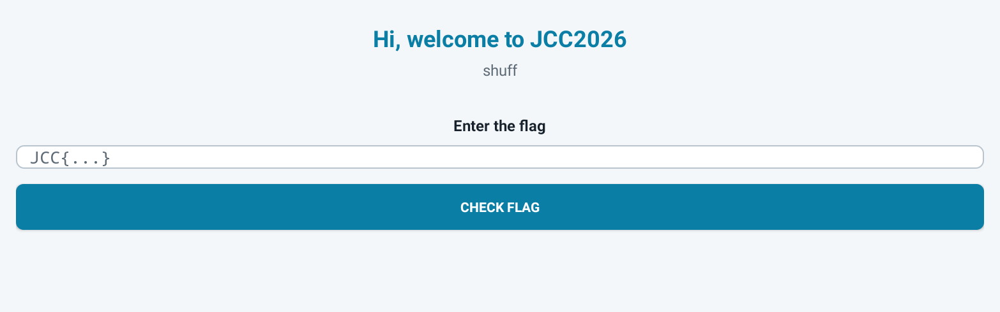
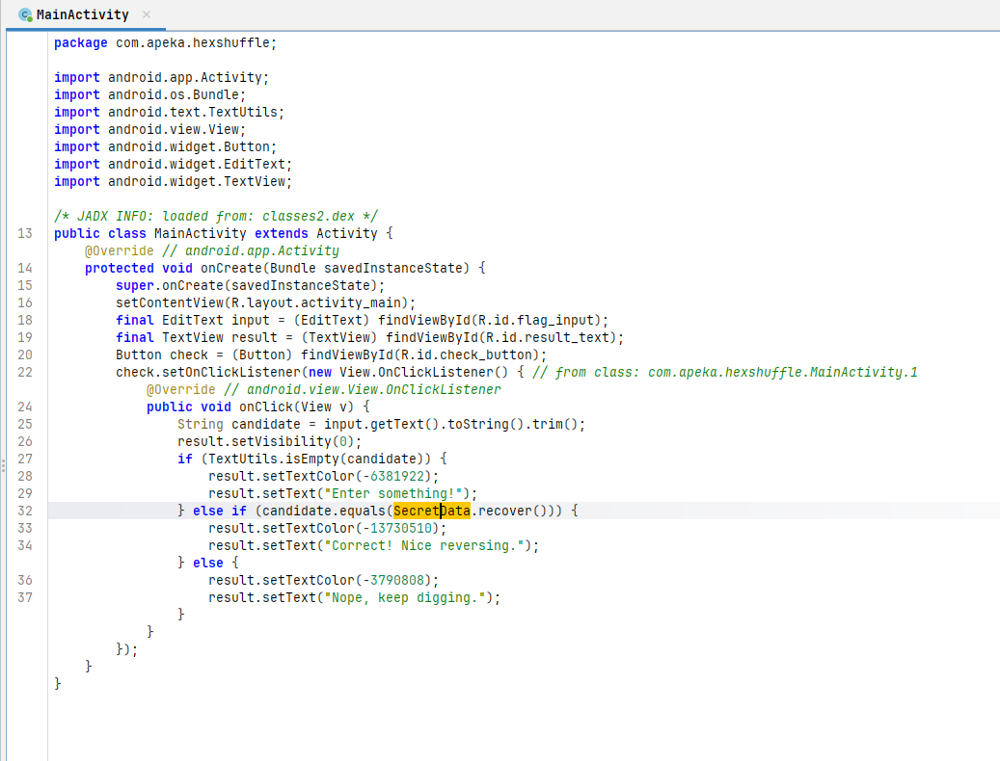
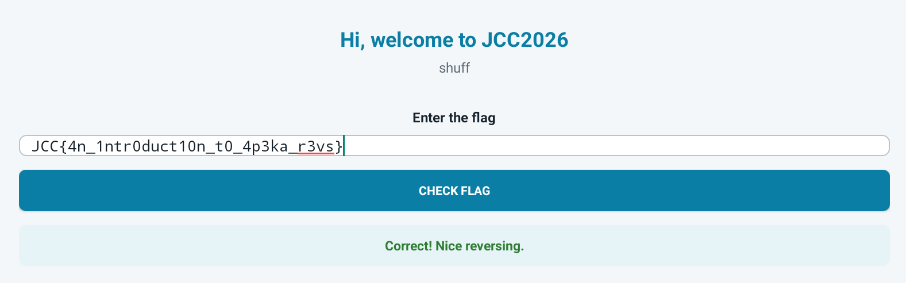

# shuff dot apeka - Proof of Concept

> JCC 2026 - Reverse Engineering - Baby - UrSourceCode

Untuk versi bahasa indonesia dapat diakses pada [link berikut](README-id.md).

## Author Notes

### Idea

`shuff dot apeka` was designed as a Baby Reverse Engineering challenge for participants who might be new to APK reversing. The goal was to keep the mechanism simple: decompile the application, follow the checker logic, and reconstruct the shuffled flag data.

### Challenge Construction

The flag body is split into characters and stored in `SecretData.ASCII` in a shuffled order. The correct reconstruction order is stored separately in `IndexMap.ORDER`, while `SecretData.recover()` walks that index map and rebuilds the flag.

```text
flag
 ↓
split into characters
 ↓
shuffle into SecretData.ASCII
 ↓
store reconstruction order in IndexMap.ORDER
 ↓
build APK
```

### Intended Solve Path

```text
APK
 ↓
decompile with JADX / another APK decompiler
 ↓
follow the input checker
 ↓
SecretData
 ↓
IndexMap.ORDER
 ↓
reorder the characters
 ↓
recover the flag
```

The intended lesson is simple: an APK can be decompiled, navigated, and understood without requiring native-code analysis.

We were given an APK file. When we open it, it shows:



It looks like a flag checker.

## Decompile

We can decompile the APK using an [online decompiler](https://www.decompiler.com/jar/291e2672ccea3518ada734f6cf831d40/shuff.apk) or JADX. Here is the result:



The main class shows that the input checker calls the `SecretData` class. Opening the `SecretData` class, we get:

```java
package com.apeka.hexshuffle;

/* JADX INFO: loaded from: classes2.dex */
public final class SecretData {
    static final String[] ASCII = {"r", "4", "t", "n", "_", "s", "a", "_", "4", "1", "0", "1", "d", "n", "0", "r", "t", "c", "_", "k", "t", "p", "_", "n", "3", "3", "u", "0", "v"};

    private SecretData() {
    }

    public static String recover() {
        StringBuilder sb = new StringBuilder();
        for (int i : IndexMap.ORDER) {
            sb.append(ASCII[i]);
        }
        return "JCC{" + ((Object) sb) + "}";
    }
}
```

The flag is shuffled using the `IndexMap` class. Here is the `IndexMap` class:

```java
package com.apeka.hexshuffle;

/* JADX INFO: loaded from: classes2.dex */
public final class IndexMap {
    static final int[] ORDER = {1, 13, 7, 11, 23, 20, 15, 14, 12, 26, 17, 2, 9, 27, 3, 4, 16, 10, 22, 8, 21, 24, 19, 6, 18, 0, 25, 28, 5};

    private IndexMap() {
    }
}
```

## Solving

As shown in the `SecretData` class, the flag is recovered and wrapped in `JCC{<flag>}` following the order in the `IndexMap` class. So, we get:

```py
ASCII = [
    "r", "4", "t", "n", "_", "s", "a", "_", "4", "1", "0", "1", "d", "n", "0", "r", "t", "c", "_", "k", "t", "p", "_", "n", "3", "3", "u", "0", "v"
]

ORDER = [
    1, 13, 7, 11, 23, 20, 15, 14, 12, 26, 17, 2, 9, 27, 3, 4, 16, 10, 22, 8, 21, 24, 19, 6, 18, 0, 25, 28, 5
]

flag = 'JCC{' + ''.join(ASCII[i] for i in ORDER) + '}'
print(flag)
```

The flag is: `JCC{4n_1ntr0duct10n_t0_4p3ka_r3vs}`

Put it into the APK (if you want), and it shows:


