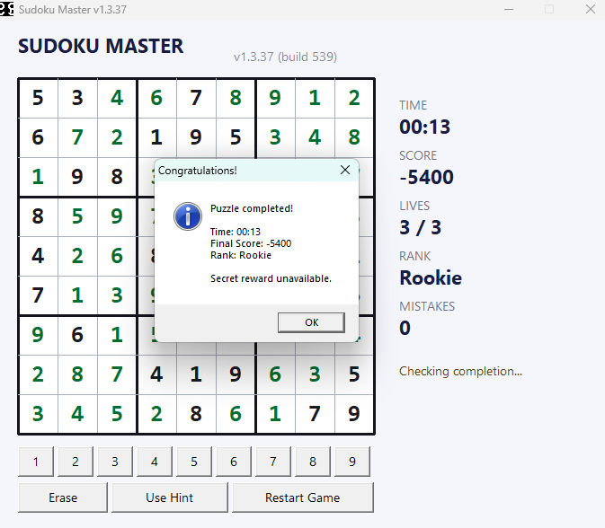
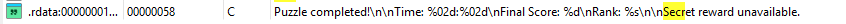
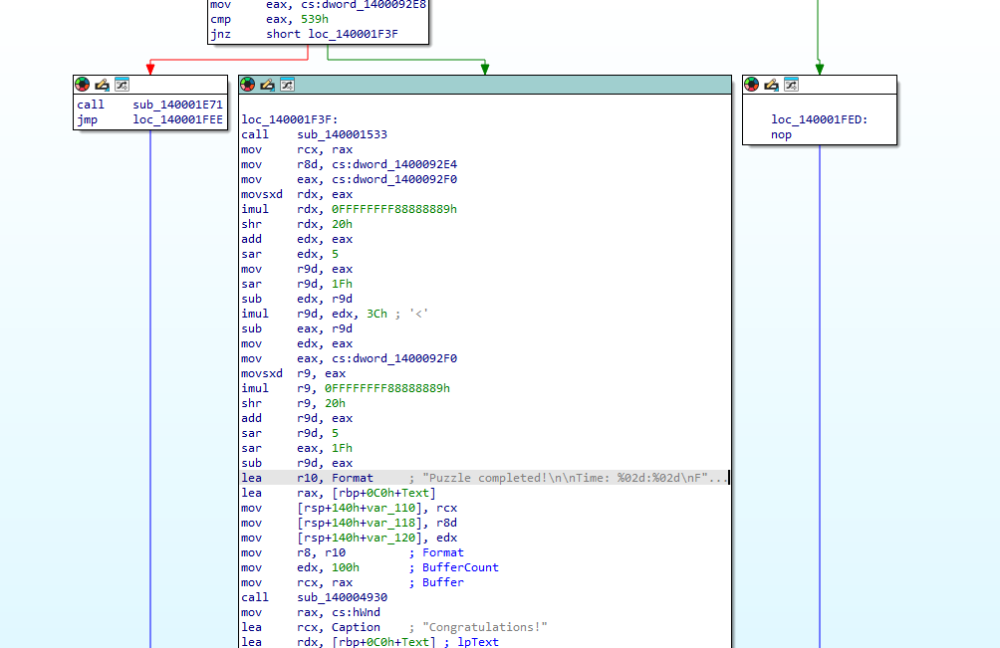
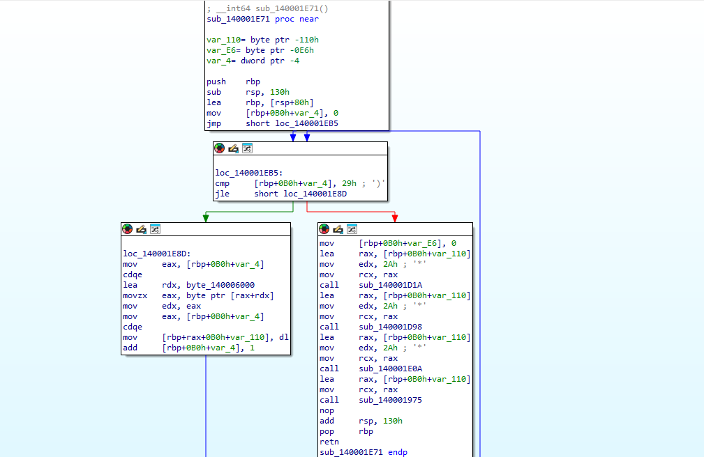

# Sudoku - Proof of Concept

> JCC 2026 - Reverse Engineering - Easy - UrSourceCode

Untuk versi bahasa indonesia dapat diakses pada [link berikut](README-id.md).

This write-up uses only IDA Free and the participant-deliverable
`release/Sudoku.exe`. No source code or debugger is required.

## Find the interesting string

After completing the puzzle, the game displays:

```text
Secret reward unavailable.
```



Open `release/Sudoku.exe` in IDA Free, wait for auto-analysis to finish, and
search for that string in the Strings window.



Follow its DATA XREF. The reference leads to the normal-win branch of the
completion-check function.



## Find the hidden condition

Inspecting the nearby control-flow graph, the important instructions are:

```asm
mov     eax, cs:dword_1400092E8
cmp     eax, 539h
jnz     short normal_win
call    sub_140001E71
```

`539h` is hexadecimal for decimal `1337`. The code is equivalent to:

```c
if (secret_score == 1337)
    reveal_flag();
else
    show_normal_win();
```

This explains why normal completion produces `Secret reward unavailable.`:
normal gameplay does not make the hidden score equal `1337`.

## Decode the flag

Follow `sub_140001E71`:



Raw IDA decompilation:

```c
__int64 sub_140001E71()
{
    _BYTE v1[268];
    int i;

    for (i = 0; i <= 41; ++i)
        v1[i] = byte_140006000[i];
    v1[42] = 0;
    sub_140001D1A(a1: (__int64)v1, a2: 42);
    sub_140001D98(a1: v1, a2: 42);
    sub_140001E0A(a1: v1, a2: 42);
    return sub_140001975(a1: v1);
}
```

The same logic, rewritten with descriptive names, is:

```c
void reveal_flag(void)
{
    unsigned char decoded[43];

    for (int i = 0; i < 42; i++)
        decoded[i] = encrypted_flag[i];
    decoded[42] = '\0';

    byte_reverse(decoded, 42);
    xor_with_secret_score(decoded, 42);
    nibble_swap(decoded, 42);

    show_flag(decoded);
}
```

The function calls three sub-functions in sequence:

### Stage 1 — `sub_140001D1A` (byte reverse)

Raw IDA decompilation:

```c
__int64 __fastcall sub_140001D1A(__int64 a1, int a2)
{
    char v3;
    int i;
    unsigned int v5;

    v5 = 0;
    for (i = a2 - 1; ; --i)
    {
        if ((int)v5 >= i)
            break;
        v3 = *(_BYTE *)((int)v5 + a1);
        *(_BYTE *)((int)v5 + a1) = *(_BYTE *)(i + a1);
        *(_BYTE *)(a1 + i) = v3;
        ++v5;
    }
    return result;
}
```

The same logic, rewritten with descriptive names:

```c
void byte_reverse(unsigned char *buf, int len)
{
    int i = 0, j = len - 1;
    while (i < j) {
        unsigned char tmp = buf[i];
        buf[i] = buf[j];
        buf[j] = tmp;
        i++;
        j--;
    }
}
```

This reverses the byte order of the buffer.

### Stage 2 — `sub_140001D98` (XOR with runtime-derived key)

Raw IDA decompilation:

```c
__int64 __fastcall sub_140001D98(__int64 a1, int a2)
{
    char v3;
    unsigned int i;

    v3 = (7 * dword_1400092E8 + 13) % 256;
    for (i = 0; ; ++i)
    {
        if ((int)i >= a2)
            break;
        *(_BYTE *)((int)i + a1) ^= v3;
    }
    return result;
}
```

The same logic, rewritten with descriptive names:

```c
void xor_with_secret_score(unsigned char *buf, int len)
{
    unsigned char key = (secret_score * 7 + 13) % 256;
    for (int i = 0; i < len; i++)
        buf[i] ^= key;
}
```

`secret_score` is the hidden variable (`dword_1400092E8`). When `secret_score == 1337`,
the XOR key is `(7 * 1337 + 13) % 256 = 0x9C`.

### Stage 3 — `sub_140001E0A` (nibble swap)

Raw IDA decompilation:

```c
__int64 __fastcall sub_140001E0A(__int64 a1, int a2)
{
    unsigned int i;

    for (i = 0; ; ++i)
    {
        if ((int)i >= a2)
            break;
        *(_BYTE *)((int)i + a1) = (16 * *(_BYTE *)((int)i + a1))
                                 | (*(_BYTE *)((int)i + a1) >> 4);
    }
    return result;
}
```

The same logic, rewritten with descriptive names:

```c
void nibble_swap(unsigned char *buf, int len)
{
    for (int i = 0; i < len; i++)
        buf[i] = (buf[i] << 4) | (buf[i] >> 4);
}
```

This swaps the high and low nibbles of each byte. The same operation is
self-inverse (applying it twice returns the original byte).

### Solving

The encrypted flag bytes at `byte_140006000` are:

```text
4B CA BB 9F AA AB 69 DB AF BF AA CA AB 69 AF 1A
DB 69 CA 4A 69 AF FB 8F EA 69 BB AF FB AF 7A 69
CB 2A 9F DA CB AB 2B A8 A8 38
```

Because `stage2_xor` depends on `secret_score == 1337`, the XOR key is known to be
`0x9C` when the hidden condition is satisfied. The three stages can be reversed
statically:

```python
encrypted = bytes.fromhex(
    "4B CA BB 9F AA AB 69 DB AF BF AA CA AB 69 AF 1A "
    "DB 69 CA 4A 69 AF FB 8F EA 69 BB AF FB AF 7A 69 "
    "CB 2A 9F DA CB AB 2B A8 A8 38"
)

reversed_bytes = bytes(reversed(encrypted))
key = (1337 * 7 + 13) % 256
xored = bytes(b ^ key for b in reversed_bytes)
flag = bytes(((b >> 4) | ((b & 0x0F) << 4)) & 0xFF for b in xored)

print(flag.decode("ascii"))
```

Output:

```text
JCC{sud0ku_n3v3r_g1v3_me_th3_sec23t_sc0re}
```

This static route recovers the flag directly from the executable.